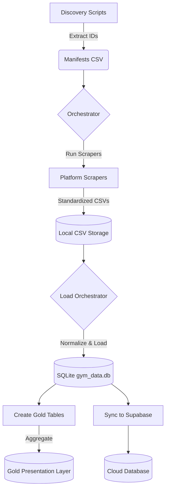

# GymTendency

GymTendency is a robust data engineering and analytics pipeline designed to aggregate, normalize, and analyze gymnastics competition results from multiple sources. It automates the entire process from discovering meets to presenting curated data for analysis.

## 🚀 Key Features

- **Multi-Source Data Acquisition**: Scrapers for major gymnastics scoring platforms:
  - **K-Score** (`kscore_scraper.py`)
  - **LiveMeet** (`livemeet_scraper.py`)
  - **MeetScoresOnline (MSO)** (`mso_scraper.py`)
  - **KSIS** (`ksis_scraper.py`)
- **Automated Orchestration**: Robust orchestrators manage the extraction, scraping, and loading phases, handling retries and manifest tracking.
- **Advanced Data Normalization**: A sophisticated alias system standardizes:
  - **Clubs**: Merging variation names into canonical titles.
  - **Athletes**: Mapping aliases and misspellings to unique person IDs.
  - **Levels**: Canonicalizing level names across different scoring systems.
- **Quality Assurance**: Integrated audit scripts to verify data completeness, schema integrity, and CSV-to-DB consistency.
- **Scalable Storage**: Processes raw data into a local SQLite database (`gym_data.db`) and supports syncing to **Supabase** for web deployments.

## 📂 Project Structure

- `extract_*_ids.py`: Discovery scripts that generate manifests of meets to scrape.
- `*_scraper.py`: Platform-specific scrapers that generate standardized CSV outputs.
- `*_load_data.py`: Loaders that ingest CSV data into the SQLite database.
- `orchestrator.py` & `load_orchestrator.py`: Management scripts for the scraping and loading pipelines.
- `etl_functions.py`: Core logic for data cleaning, alias resolution, and database operations.
- `create_gold_tables.py`: SQL-based generation of high-quality, aggregated "Gold" tables for analysis.
- `sync_to_supabase_robust.py`: Utility to push processed data to a cloud database.
- `*.json`: Aliases and configuration files for data standardization.

## 🔄 Data Pipeline Workflow

1.  **Discovery**: Run `extract_*_ids.py` to update the manifests of available meets.
2.  **Scraping**: Execute platform scrapers (or `orchestrator.py`) to fetch raw competition data.
3.  **Loading**: Use `load_orchestrator.py` to process CSVs and populate the local SQLite database.
4.  **Normalization**: The pipeline automatically applies aliases for clubs, levels, and athletes during the ETL process.
5.  **Refinement**: Run `create_gold_tables.py` to generate the presentation-ready data layer.

For detailed instructions, see [WORKFLOW.md](WORKFLOW.md).

## 📊 Data Specification

Data is captured according to the Olympic apparatus order:
- **WAG**: Vault, Uneven Bars, Beam, Floor.
- **MAG**: Floor, Pommel Horse, Rings, Vault, Parallel Bars, High Bar.

Each result captures D-Scores, Final Scores, and Ranks where available. Detailed schema information can be found in [METADATA_SPEC.md](METADATA_SPEC.md).

## 🛠️ Tech Stack

- **Language**: Python 3
- **Database**: SQLite3, Supabase (PostgreSQL)
- **Scraping**: BeautifulSoup4, Selenium
- **Data Handling**: Pandas, JSON
- **Environment**: Virtualenv